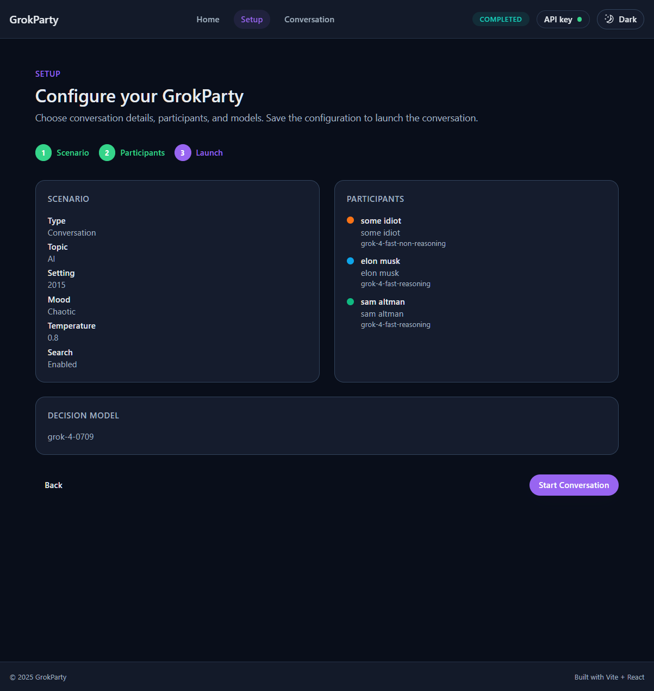

# GrokParty Web

GrokParty Web is a browser app for orchestrating Grok-powered, multi-speaker sessions entirely client-side. Configure your panel, stream the dialog live, and export transcripts without standing up any services of your own.

**What it delivers**
- Guided setup flow for scenario design, persona authoring, and Grok model selection.
- Live conversation view with pause/resume controls and downloadable transcripts.
- Secure-by-default API key handling that stays in the browser.
- Dark-mode friendly, responsive UI tuned for longer-running sessions.
- Host controls for pausing, resuming, and inserting named interjections mid-conversation.

## Feature tour

The home screen highlights key actions—manage your Grok API key, jump into the setup wizard, and review the live transcript or configuration summaries at a glance. Status pills keep you informed about API key detection and session state.

Step one of the setup wizard captures the scenario: conversation type, mood, topic, optional setting, the host name participants should address, model temperature, and whether Grok's web search assistance should stay enabled. Everything is tuned for fast adjustments with sensible defaults.

Participants are fully configurable. Name each persona, pick the Grok model that matches their role, and refresh the available model list without leaving the flow.

Before you launch, review a consolidated summary of the scenario, participants, and decision model so you can make quick last-minute tweaks.

During a session, real-time responses stream into a conversation timeline beside the configuration context. Pause, resume, or stop at will, inject host-authored turns that use the configured name, and download the full transcript—configuration included—for follow-up analysis.

## Documentation
- [Getting started guide](docs/getting-started.md)
- [Architecture overview](docs/architecture.md)
